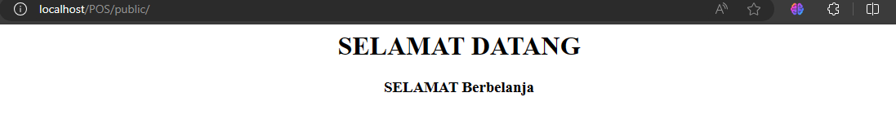
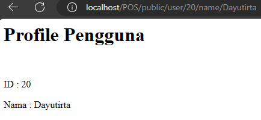
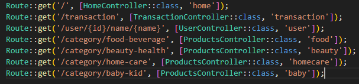
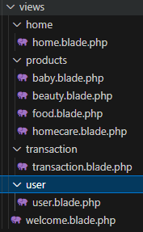

# SOAL PRAKTIKUM POINT OF SALES

1. Jalankan Langkah-langkah Praktikum pada jobsheet di atas. Lakukan sinkronisasi perubahan pada project PWL_2024 ke Github. 
[Click here](https://github.com/dayutirta/PWL_2024) 

2. Buatlah project baru dengan nama POS. Project ini merupakan sebuah aplikasi Point of Sales yang digunakan untuk membantu penjualan. 

3. Buatlah beberapa route, controller, dan view sesuai dengan ketentuan sebagai berikut. 

- <B>HOME PAGE</B>

- <B>PRODUCT PAGE
</B>
a. food-beverage page 

b. beauty-health  page 

c. home-care page 

d. baby-kid page 

- <B>USER PAGE</B>

- <B>TRANSACTION PAGE</B>

4. Route tersebut menjalankan fungsi pada Controller yang berbeda di setiap halaman. 

5. Fungsi pada Controller akan memanggil view sesuai halaman yang akan ditampilkan. 
